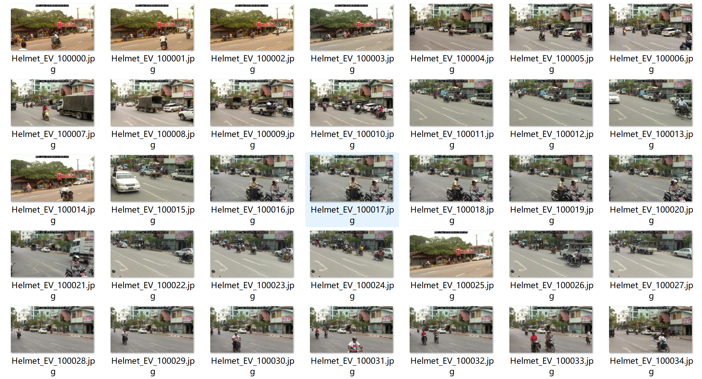
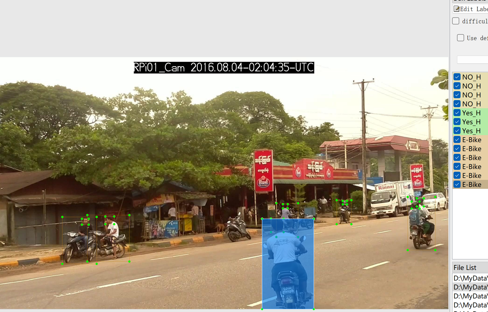

# Electric Bike Helmet Detection Dataset - Object Detection Dataset

Dataset Information: A total of 7366 images and corresponding annotation files are available. The annotation files are provided in two formats: VOC (xml) and YOLO (txt).

`E-Bike`, `NOH`, `YesH`

The number of images and the number of bounding box annotations for each category are as follows: (Annotations are usually labeled in English, but the Chinese subtitles provided in parentheses are for reference)

Note: An image may have multiple objects being annotated, so the total number of bounding boxes may be greater than the total number of images.

The complete dataset consists of three folders and one txt file:

- `all_images`: Stores the dataset's images, screenshots included:
- `all_txt` and `classes.txt`: Stores the YOLO formatted txt annotation files, in the same quantity as the images, with each annotation file corresponding to a single image.
- `classes.txt`:
- `all_xml`: VOC formatted xml annotation files.
- The number and images correspond, with each annotation file corresponding to a single image.

To understand the standard format of the VOC format, please search on Baidu yourself.

Both formats of annotations are usable; choose one based on your preference.

Annotation screenshots:

## Images

Here is a pay link on Stripe ( https://buy.stripe.com/3cs8yP7sY87d0vu9AB ). Please contact me lonlonago@foxmail.com after funding $89, and I will send you a complete data files , thank you!

